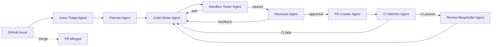
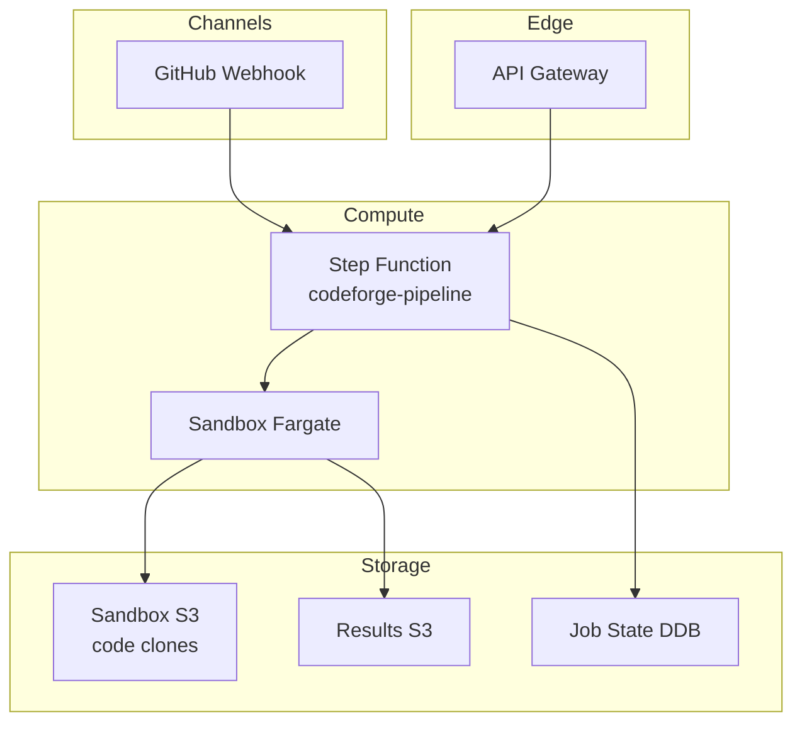

# CodeForge

> Multi-agent software engineering team. Takes a GitHub issue, writes a fix, runs tests in a sandbox, opens a PR, and responds to review comments. Self-reflecting, with long-horizon planning.

[](LICENSE)
[]()
[]()
[]()
[]()
[]()

---

## What this solves

AI coding assistants are great at single-file edits, but real engineering work requires:

- Reading an entire repo, understanding the build system, finding the right test to run
- Writing multi-file changes that preserve backwards compatibility
- Running tests in an isolated sandbox (so a bad code change can't crash the dev machine)
- Iterating on CI feedback
- Reviewing its own PR and fixing review comments
- Self-reflection after a task fails to learn what went wrong

CodeForge is a multi-agent SWE team that handles the full lifecycle of a code change, end-to-end.



## Key features

- **Multi-agent pipeline** — 8 specialized agents, each with a focused role
- **Sandboxed execution** — code runs in Fargate containers, no host access
- **Self-reflection** — agents review their own work and learn from failures
- **Long-horizon planning** — Planner Agent decomposes issues into subtasks
- **CI feedback loop** — automatically responds to test failures
- **GitHub-native** — uses GitHub API + webhooks for issue → PR → merge

## Architecture at a glance



Full architecture: [`docs/architecture/00-overview.md`](docs/architecture/00-overview.md).

## What you'll find here

| Area | Path |
|---|---|
| **ADRs** (decision log) | [`docs/adr/`](docs/adr/) |
| **Architecture** | [`docs/architecture/`](docs/architecture/) |
| **Runbooks** | [`docs/runbooks/`](docs/runbooks/) |

## Quick start

```bash
bash scripts/bootstrap.sh codeforge dev ap-south-1
cd infra/terraform
terraform init -backend-config="bucket=codeforge-tfstate-dev" \
                -backend-config="region=ap-south-1" \
                -backend-config="dynamodb_table=codeforge-tfstate-lock-dev"
terraform plan -var-file=envs/dev.tfvars
terraform apply -var-file=envs/dev.tfvars
```

## License

Apache 2.0 — see [`LICENSE`](LICENSE).
