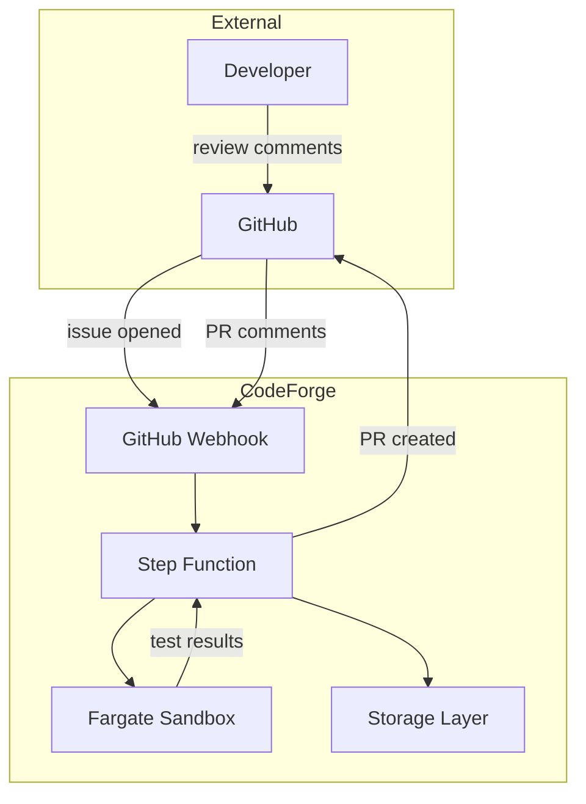
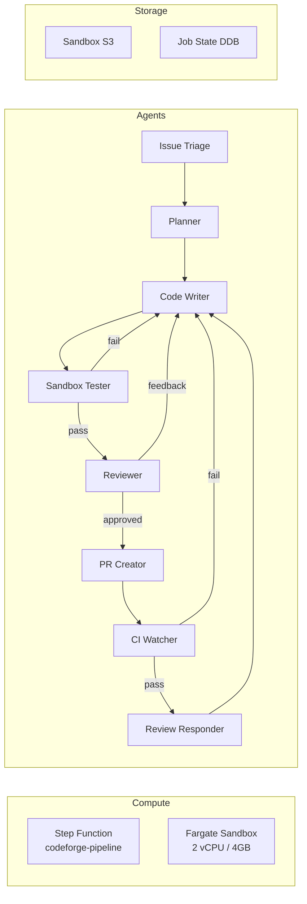

# Architecture Overview

CodeForge is a multi-agent SWE team that takes a GitHub issue and produces a merged PR. The system uses a Step Function to coordinate 8 specialized agents, with Fargate Sandboxes for safe code execution.

## System context

## High-level architecture

## Pipeline stages

1. **Issue Triage** — fetch the issue, understand it
2. **Planner** — decompose into 3-7 subtasks
3. **Code Writer** (loop) — write code, get review feedback
4. **Sandbox Tester** — run tests in isolated env
5. **Reviewer** — self-review; if approved → PR Creator, else → Code Writer
6. **PR Creator** — open the PR
7. **CI Watcher** — wait for CI; if fail → Code Writer
8. **Review Responder** — address review comments

## Why this design

| Concern | Decision | Why |
|---|---|---|
| Long-horizon | Claude Agent SDK | Best for SWE-bench-style |
| Self-reflection | Explicit retry loop | 2-3× better pass rate |
| Isolation | Fargate Spot | Strong isolation, cheap |
| State | DynamoDB | Cheap, queryable |
| Code | S3 + Git | Native GitHub integration |

## Where to read next

- [HLD](01-hld.md) — Service boundaries
- [LLD](02-lld.md) — Data shapes
- [Security model](06-security-model.md) — Trust boundaries
